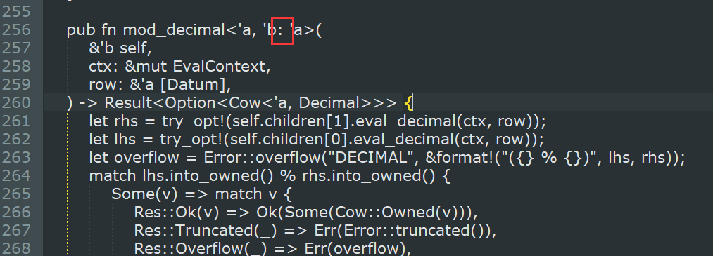
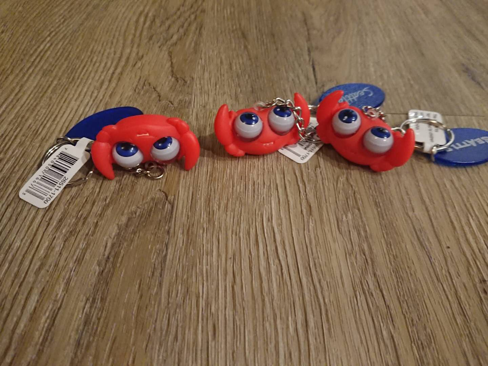

# 2018-08-11

来源：《Rust 夜读》微信群

时间：2018-08-11

## 问题 1：Rust 比 Golang 还难吗？

- A0：只学过 Rust 的一点点语法，晦涩难懂。
- A1：Golang 入手简单，写完后你都不知道对错，Rust 入手难，写完后 90% 都是对的。

## 问题 2：Rust 的优势在哪里？

- A0：编译器很屌。
- A1：没有 gc，没有泄露，适合高性能低延时的服务。

## 问题 3：Rust 的应用场景是哪方面？

- A：TiDB--->TiKV（Key-Value 基础底层服务）

## **问题 4：这个冒号是什么意思？**

- A0：b 至少比 a 活得久。

貌似这个文档【[https://doc.rust-lang.org/book/second-edition/ch10-03-lifetime-syntax.html](https://doc.rust-lang.org/book/second-edition/ch10-03-lifetime-syntax.html)】上没有相关的说明？

在官方文档（第二版），Advanced Lifetime 有相关说明的。

- [https://kaisery.github.io/trpl-zh-cn/ch19-02-advanced-lifetimes.html](https://kaisery.github.io/trpl-zh-cn/ch19-02-advanced-lifetimes.html)

## 问题 5：TiKV（Rust 项目）编译起来真的是非常耗资源啊！！！

- A0（TiKV member）：Try turning up the code gen units in Cargo.toml

>尝试在 `Cargo.toml` 中打开代码 gen 单元。

- A1（TiKV member）：We are trying to make the compile time faster on rebuild right now.

>我们正在努力使重新编译时间更快。

## 问题 6：Rust 有人用吗？

1. TiKV
2. Facebook(version control)
3. Dropbox
4. Firefox
5. Discord
6. Linkerd
7. Google(fuschia)

## 问题 6：Rust 有哪些学习资料？

- A0：[Rust 官方文档](https://www.rust-lang.org/zh-CN/index.html)
- A1：[dcode - Rust Programmig Tutorial](https://www.youtube.com/playlist?list=PLVvjrrRCBy2JSHf9tGxGKJ-bYAN_uDCUL)
- A2：[Rust Primer](https://rustcc.gitbooks.io/rustprimer/content/)

## 其他

1. [https://medium.com/@carllerche/tower-web-a-new-web-framework-for-rust-e2912856851b](https://medium.com/@carllerche/tower-web-a-new-web-framework-for-rust-e2912856851b)
